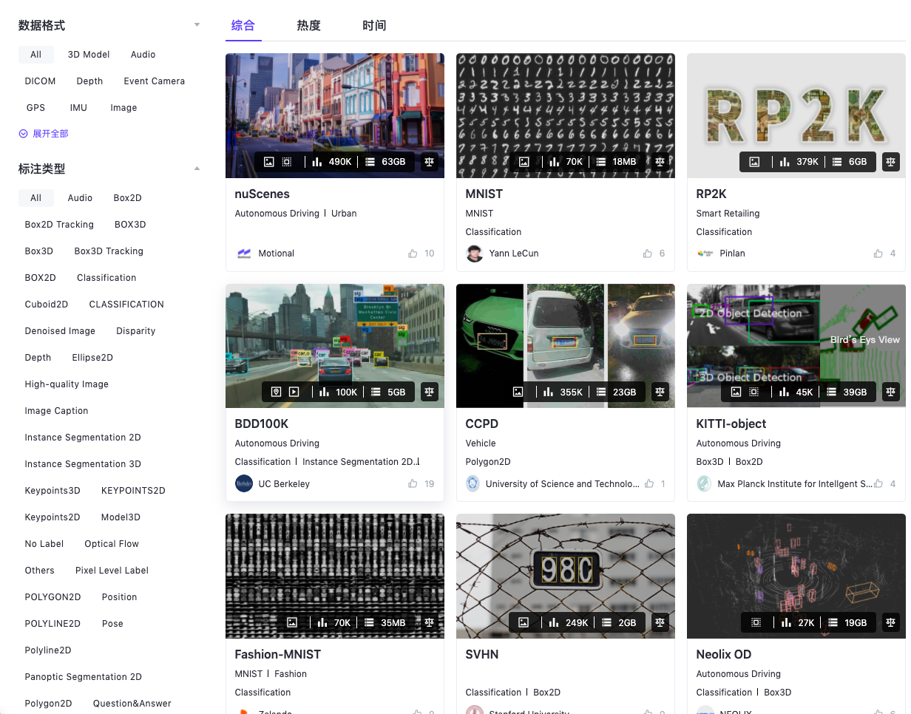

# 动手实现全景图像语义分割

[TOC]

## 导读

本文手把手带你完成一个有趣的应用——全景图像语义分割。相信许多读者体验过b站上的全景视频，如果还没有，快来体验一下吧[1]！只需鼠标点击并移动，便可360度无死角的浏览全景视频。现在，随着insta360，go pro等相机发展趋于成熟，全景图像数据的获取唾手可得。和普通相机拍摄得到的数据不同，全景图像数据分布在球面上，如下图所示，如果将全景图像展开则会造成畸变，因此，直接将传统二维平面图像处理方法应用到球面数据上，其效果则会大大降低。


本文从以下几个方面展开

- 数据获取
- 模型构建
- 训练
- 测试

本教程以及相关代码在https://github.com/QiangZiBro/spherical_image_segmentation_tutorial

## 环境搭建

### 实验环境

- Ubuntu20.04
- CUDA11.0
- Pytorch1.7

### Docker相关安装

```bash
# 安装docker
sudo apt install -y docker docker.io
# 安装英伟达docker
distribution=$(. /etc/os-release;echo $ID$VERSION_ID) \
&& curl -s -L https://nvidia.github.io/nvidia-docker/gpgkey | sudo apt-key add - \
&& curl -s -L https://nvidia.github.io/nvidia-docker/$distribution/nvidia-docker.list | sudo tee /etc/apt/sources.list.d/nvidia-docker.list
sudo apt-get update
sudo apt-get install -y nvidia-docker2
# 安装docker-compose
pip install docker-compose

# 最后
sudo systemctl daemon-reload
sudo systemctl restart docker
```

考虑到环境构建和移植的方便，使用docker进行构建

```bash
git clone https://github.com/QiangZiBro/spherical_image_segmentation_tutorial
cd spherical_image_segmentation_tutorial
docker build -t spherical .
```

如果docker镜像构建过程出现了网络问题，可以参考文章[2]，笔者已经将构建好并上传至百度云[3]，下载后

```bash
docker load < spherical.tar
```

即可使用！

## 数据集获取

这里推荐从Graviti AI Services https://gas.graviti.cn/这个网站下载数据集[3]，Graviti AI Services是国内一家数据集网站，这个网站汇总AI开发者常见的公开数据集，更方便的是，能以github一般的感觉去操纵数据集。




## 训练


## 测试


## 总结

本文动手实现了全景图语义分割这个任务，环境搭建使用docker，简化了环境配置，

## 参考资料

[ 1 ] : https://www.bilibili.com/video/BV1NT4y1w7cy?from=search&amp;seid=10079355191633664125

[ 2 ] : https://mp.weixin.qq.com/s/RZqa9aNgK--7pnkJHV1cAw

[ 3 ] :https://gas.graviti.cn/

[ 4 ] : https://gas.graviti.cn/

