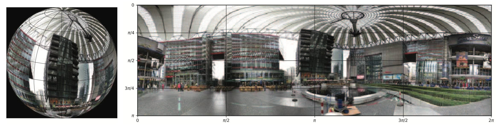

# 动手实践全景图像语义分割

[TOC]

> 作者介绍：张强（QiangZiBro），Datawhale成员，宁波大学研究生，研究方向为矢量型神经网络和三维视觉。

## 导读

本文手把手带你完成一个有趣的应用——全景图像语义分割。相信许多读者体验过b站上的全景视频，如果还没有，快来体验一下吧[1]！只需鼠标点击并移动，便可360度无死角的浏览全景视频。现在，随着insta360，go pro等相机发展趋于成熟，全景图像数据的获取唾手可得。和普通相机拍摄得到的数据不同，全景图像数据分布在球面上，如下图所示，如果将全景图像展开则会造成畸变，因此，直接将传统二维平面图像处理方法应用到球面数据上，其效果则会大大降低。



而要解决分布在球面空间上的数据，需要特定的方法，比如球面卷积网络。本文从以下几个方面展开

- 环境构建
- 数据获取
- 模型构建
- 训练
- 测试

本教程以及相关代码在https://github.com/QiangZiBro/spherical_image_segmentation_tutorial

```bash
git clone https://github.com/QiangZiBro/spherical_image_segmentation_tutorial
cd spherical_image_segmentation_tutorial
```

## 环境构建

基于深度学习的编程环境往往有各种复杂的环境依赖，而各种安装报错总是消磨我们的时间，其实之一过程可以大大缩短。我们所需要的也就是通过一个命令安装所有的依赖并打开环境

```bash
make up #等价于 docker-compose up -d
```

再通过一个命令

```bash
make in
```

来进入我们需要的环境，然后运行程序。为实现构建这一过程，基于`docker` –`docker-compose` – `make`来搭建我们的环境，其原理如下图所示：


`docker` –`docker-compose` – `make`三个工具对应三个配置文件，都在项目根目录进行了声明：

```txt
Dockerfile
docker-compose.yml
Makefile
```

其中

- `Dockerfile` 定义了实验所需要的所有环境，依据此文件可以编译成docker镜像，其中包含我们需要的库
- `docker-compose.yml`定义了镜像的启动方式，在本文中，我们定义两个服务，一个作为终端来运行命令，一个作为`jupyter lab`供调试
- `Makefile`定义了启动环境的方式

本文实验环境

- Ubuntu20.04
- CUDA11.0
- Pytorch1.7

### Docker安装

```bash
# 1.安装docker
sudo apt install -y docker docker.io
# 2.安装英伟达docker
distribution=$(. /etc/os-release;echo $ID$VERSION_ID) \
&& curl -s -L https://nvidia.github.io/nvidia-docker/gpgkey | sudo apt-key add - \
&& curl -s -L https://nvidia.github.io/nvidia-docker/$distribution/nvidia-docker.list | sudo tee /etc/apt/sources.list.d/nvidia-docker.list
sudo apt-get update
sudo apt-get install -y nvidia-docker2
# 3.安装docker-compose(apt常常不能安装最新版本的docker-compose)
pip install docker-compose
# 4.解决linux下docker的权限问题，将用户放在docker组里
GROUPNAME=docker
getent group $GROUPNAME 2>&1 >/dev/null || groupadd $GROUPNAME
sudo usermod -aG docker $(whoami)
# 5.重启
sudo systemctl daemon-reload
sudo systemctl restart docker
```

### 使用Docker镜像

Docker镜像构建好之后，可以直接运行docker命令启动镜像，但是这样不是最方便的。使用`docker-compose`搭配`Makefile`，具体操作如下：首先写好`docker-compose.yml`启动文件，可参考本项目对应的[docker-compose.yml](https://github.com/QiangZiBro/spherical_image_segmentation_tutorial/blob/main/docker-compose.yml)，接着，在Makefile里写常见docker相关命令，我们将应用分为启动（up）、关闭（down）、进入容器环境（in）三个需求，Makefile如下：

```makefile
up:
	docker-compose up -d

down:
	docker-compose down

in:
	docker-compose exec spherical-env bash
```

本项目镜像已上传dockerhub，可以直接使用下列命令下载

```bash
docker pull qiangzibro/spherical_image_segmentation
#或者下面命令自己编译
make build
```

接着，一键完成编译、启动

```bash
make up #等价于 docker-compose up -d
```

再通过下列命令便可以进入终端

```bash
make in
```

使用`docker-compose logs`还可以看到notebook对应的网址。

## 数据获取

使用2D-3D-S 数据集进行本实验，该数据集提供了来自 2D、2.5D 和 3D 域的各种相互注册的数据，以及实例级语义和几何注释。 它收集在来自 3 座不同建筑的 6 个大型室内区域。 它包含超过 70,000 张 RGB 图像，以及相应的深度、表面法线、语义注释、全局 XYZ 图像（均以常规和 360° 等距柱状图图像的形式）以及相机信息。 它还包括注册的原始和语义注释 3D 网格和点云。

使用国内数据集网站：https://gas.graviti.cn/，这个网站汇总了AI开发者常见的公开数据集，更方便的是，我们能通过命令上传、下载数据集。对于发布在网站上的数据集，fork后还可以通过命令行进行下载。

打开https://gas.graviti.cn/ —> 登录 —> 我们可以使用常见的方式进行登录


为方便后续使用，笔者选择使用命令来上传、下载数据集，点击开发者工具，获取一个AccessKey，并拷贝这个AccessKey


打开命令行

```bash
pip3 install tensorbay
# 将ACCESSKEY写入
gas auth [ACCESSKEY]
```

将数据下载完成后，放在项目的`data`文件夹下，搜索`spherical_segmentation`点击进入


选择数据集后进入数据集详情页，点击右上角的【探索数据集】，在下拉框选择【Fork数据集】，可将该公开数据集创建副本至TensorBay的工作空间

将下载后的数据放在`data`文件夹下。

## 模型构建

参考论文《Spherical CNNs on Unstructured Grids》的方法UGSCNN[3]

MeshConv对卷积算子进行定义：

```python
class MeshConv(_MeshConv):
    def __init__(self, in_channels, out_channels, mesh_file, stride=1, bias=True):
        super(MeshConv, self).__init__(in_channels, out_channels, mesh_file, stride, bias)
        pkl = self.pkl
        if stride == 2:
            self.nv_prev = pkl['nv_prev']
            L = sparse2tensor(pkl['L'].tocsr()[:self.nv_prev].tocoo()) # laplacian matrix V->V
            F2V = sparse2tensor(pkl['F2V'].tocsr()[:self.nv_prev].tocoo())  # F->V, #V x #F
        else: # stride == 1
            self.nv_prev = pkl['V'].shape[0]
            L = sparse2tensor(pkl['L'].tocoo())
            F2V = sparse2tensor(pkl['F2V'].tocoo())
        self.register_buffer("L", L)
        self.register_buffer("F2V", F2V)
        
    def forward(self, input):
        # compute gradient
        grad_face = spmatmul(input, self.G)
        grad_face = grad_face.view(*(input.size()[:2]), 3, -1).permute(0, 1, 3, 2) # gradient, 3 component per face
        laplacian = spmatmul(input, self.L)
        identity = input[..., :self.nv_prev]
        grad_face_ew = torch.sum(torch.mul(grad_face, self.EW), keepdim=False, dim=-1)
        grad_face_ns = torch.sum(torch.mul(grad_face, self.NS), keepdim=False, dim=-1)
        grad_vert_ew = spmatmul(grad_face_ew, self.F2V)
        grad_vert_ns = spmatmul(grad_face_ns, self.F2V)

        feat = [identity, laplacian, grad_vert_ew, grad_vert_ns]

        out = torch.stack(feat, dim=-1)
        out = torch.sum(torch.sum(torch.mul(out.unsqueeze(1), self.coeffs.unsqueeze(2)), dim=2), dim=-1)
        out += self.bias.unsqueeze(-1)
        return out
```

分割网络的定义


```python
class SphericalUNet(nn.Module):
    def __init__(self, mesh_folder, in_ch, out_ch, max_level=5, min_level=0, fdim=16):
        super().__init__()
        self.mesh_folder = mesh_folder
        self.fdim = fdim
        self.max_level = max_level
        self.min_level = min_level
        self.levels = max_level - min_level
        self.down = []
        self.up = []
        self.in_conv = MeshConv(in_ch, fdim, self.__meshfile(max_level), stride=1)
        self.out_conv = MeshConv(fdim, out_ch, self.__meshfile(max_level), stride=1)
        # Downward path
        for i in range(self.levels-1):
            self.down.append(Down(fdim*(2**i), fdim*(2**(i+1)), max_level-i-1, mesh_folder))
        self.down.append(Down(fdim*(2**(self.levels-1)), fdim*(2**(self.levels-1)), min_level, mesh_folder))
        # Upward path
        for i in range(self.levels-1):
            self.up.append(Up(fdim*(2**(self.levels-i)), fdim*(2**(self.levels-i-2)), min_level+i+1, mesh_folder))
        self.up.append(Up(fdim*2, fdim, max_level, mesh_folder))
        self.down = nn.ModuleList(self.down)
        self.up = nn.ModuleList(self.up)

    def forward(self, x):
        x_ = [self.in_conv(x)]
        for i in range(self.levels):
            x_.append(self.down[i](x_[-1]))
        x = self.up[0](x_[-1], x_[-2])
        for i in range(self.levels-1):
            x = self.up[i+1](x, x_[-3-i])
        x = self.out_conv(x)
        return x

    def __meshfile(self, i):
        return os.path.join(self.mesh_folder, "icosphere_{}.pkl".format(i))
```

## 训练

在使用`make in`成功进入到容器终端后，运行`run.sh`启动训练

```bash
./run.sh
```

训练200个epoch后，可得如下结果：


## 总结

本文动手实现了全景图语义分割任务，使用docker作为环境构建，使用一种全景分割方法在全景数据集上完成了分割任务。

## 参考资料

[ 1 ] : https://www.bilibili.com/video/BV1NT4y1w7cy?from=search&amp;seid=10079355191633664125

[ 2 ] : https://mp.weixin.qq.com/s/RZqa9aNgK--7pnkJHV1cAw

[ 3 ] : https://gas.graviti.cn/

[ 4 ] :https://github.com/maxjiang93/ugscnn/

