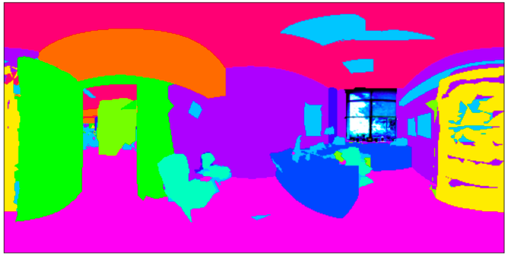
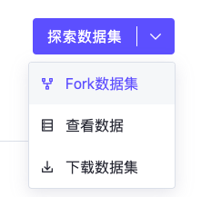
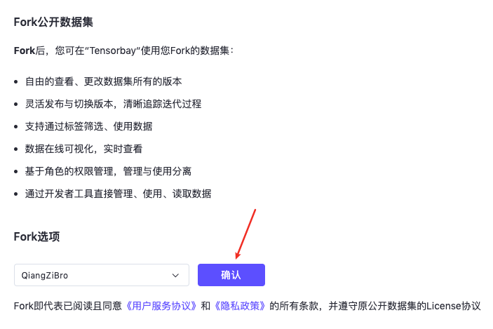
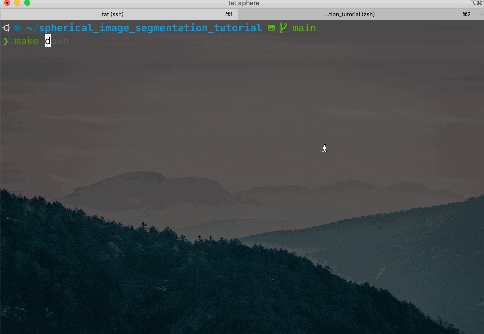
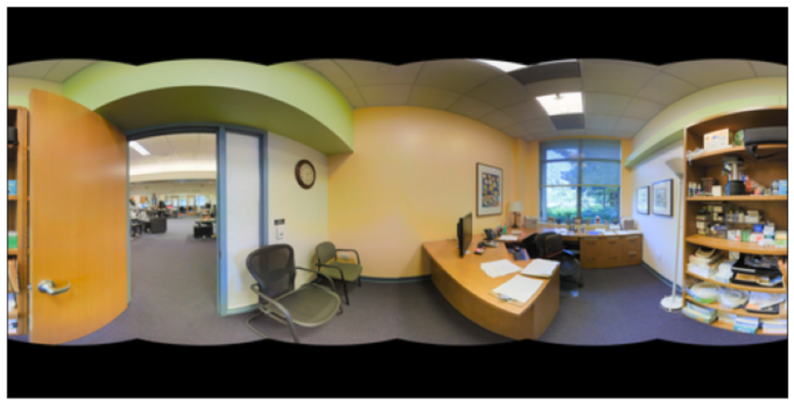
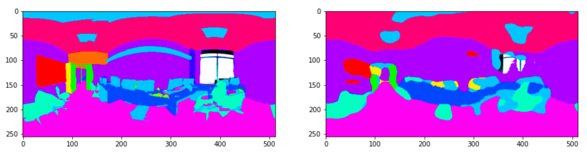

# 动手实践全景图像语义分割

[TOC]

> 作者介绍：张强（QiangZiBro），Datawhale成员。

## 导读

相信许多读者体验过b站上的全景视频，如果还没有，快来体验一下吧[1]！只需鼠标点击并移动，便可360度无死角的浏览全景视频。全景图像，又称360°全景图，其数据分布在球面空间上。如下图所示，如果将全景图像展开则会造成畸变，因此，直接将传统二维平面图像处理方法应用到球面数据上，其效果则会大大降低。要解决分布在球面空间上的数据，需要特定的方法，比如球面卷积网络。本文手把手带你实践一个有趣的应用——全景图像语义分割，并对多种传统CNN方法和球面CNN方法进行对比。


如下图所示，全景图分割实例为像素级别分类，每种实例对应一个标签。完成本教程后，你将能够做一个如下图所示的全景图小应用。



本教程以及相关代码托管在https://github.com/QiangZiBro/spherical_image_segmentation_tutorial，欢迎讨论、提Issue

```bash
git clone https://github.com/QiangZiBro/spherical_image_segmentation_tutorial
cd spherical_image_segmentation_tutorial
```

## 环境构建

基于深度学习的编程环境往往有各种复杂的环境依赖，而各种安装报错总是消磨我们的时间，其实这个过程可以大大缩短。我们所需要的也就是通过一个命令安装所有的依赖并打开环境

```bash
make up #等价于 docker-compose up -d
```

再通过一个命令

```bash
make in
```

来进入我们需要的环境，然后运行程序。为实现构建这一过程，基于`docker` –`docker-compose` – `make`来搭建我们的环境，其原理如下图所示：


`docker` –`docker-compose` – `make`三个工具对应三个配置文件，都在项目根目录进行了声明：

```txt
Dockerfile
docker-compose.yml
Makefile
```

其中

- `Dockerfile` 定义了实验所需要的所有环境，依据此文件可以编译成docker镜像，其中包含我们需要的库
- `docker-compose.yml`定义了镜像的启动方式，在本文中，我们定义两个服务，一个作为终端来运行命令，一个作为`jupyter lab`供调试
- `Makefile`定义了启动环境的方式

本文实验环境

- Ubuntu20.04
- CUDA11.0
- Pytorch1.7

### Docker安装

```bash
# 1.安装docker
sudo apt install -y docker docker.io
# 2.安装英伟达docker
distribution=$(. /etc/os-release;echo $ID$VERSION_ID) \
&& curl -s -L https://nvidia.github.io/nvidia-docker/gpgkey | sudo apt-key add - \
&& curl -s -L https://nvidia.github.io/nvidia-docker/$distribution/nvidia-docker.list | sudo tee /etc/apt/sources.list.d/nvidia-docker.list
sudo apt-get update
sudo apt-get install -y nvidia-docker2
# 3.安装docker-compose(apt常常不能安装最新版本的docker-compose)
pip install docker-compose
# 4.解决linux下docker的权限问题，将用户放在docker组里
GROUPNAME=docker
getent group $GROUPNAME 2>&1 >/dev/null || groupadd $GROUPNAME
sudo usermod -aG docker $(whoami)
# 5.重启
sudo systemctl daemon-reload
sudo systemctl restart docker
```

### 使用Docker镜像

Docker镜像构建好之后，可以直接运行docker命令启动镜像，但是这样不是最方便的。使用`docker-compose`搭配`Makefile`，具体操作如下：首先写好`docker-compose.yml`启动文件，可参考本项目对应的[docker-compose.yml](https://github.com/QiangZiBro/spherical_image_segmentation_tutorial/blob/main/docker-compose.yml)，接着，在Makefile里写常见docker相关命令，我们将应用分为启动（up）、关闭（down）、进入容器环境（in）三个需求，Makefile如下：

```makefile
up:
	docker-compose up -d

down:
	docker-compose down

in:
	docker-compose exec spherical-env bash
```

本项目镜像已上传dockerhub，可以直接使用下列命令下载

```bash
docker pull qiangzibro/spherical_image_segmentation
# 或者使用下面命令自己编译
make build
```

接着，一键完成编译、启动

```bash
make up #等价于 docker-compose up -d
```

再通过下列命令便可以进入终端

```bash
make in
```

使用`docker-compose logs`可以看到notebook对应的网址

## 数据获取

使用**2D-3D-S 数据集**进行本实验，该数据集提供了来自 2D、2.5D 和 3D 域的各种相互注册的数据，以及实例级语义和几何注释。 它收集在来自 3 座不同建筑的 6 个大型室内区域。 它包含超过 70,000 张 RGB 图像，以及相应的深度、表面法线、语义注释、全局 XYZ 图像（均以常规和 360° 等距柱状图图像的形式）以及相机信息。 它还包括注册的原始和语义注释 3D 网格和点云。

使用国内数据集网站：https://gas.graviti.cn/，这个网站汇总了AI开发者常见的公开数据集，更方便的是，我们能通过命令上传、下载数据集。对于发布在网站上的数据集，fork后还可以通过命令行进行下载。

a. 打开本文对应数据集链接 https://gas.graviti.cn/dataset/qiangzibro/spherical_segmentation

b. 右上角注册登录

c. fork数据集





d. 点击网页上方开发者工具，获取使用SDK所需的AccessKey，获取到 AccessKey 后，将其存在项目根目录的`gas_key.py`里：

```python
KEY = "<Your-Key>"
```

然后即可以通过AccessKey可以上传数据、读取数据、使用数据，灵活对接模型开发和训练，与数据pipeline快速集成。

e. AccessKey写入后就可以写代码读取数据了，读完了一行下载代码就可以进行下载。将下载后的数据放在`data`文件夹下。

## 方法

使用多种二维CNN方法和球面卷积方法UGSCNN。其中，二维CNN有三种：

- UNet
- ResNet
- FCN

UGSCNN[3]参考自论文《Spherical CNNs on Unstructured Grids》，下面着重看一下UGSCNN的方法。MeshConv对卷积算子进行定义：

```python
class MeshConv(_MeshConv):
    def __init__(self, in_channels, out_channels, mesh_file, stride=1, bias=True):
        super(MeshConv, self).__init__(in_channels, out_channels, mesh_file, stride, bias)
        pkl = self.pkl
        if stride == 2:
            self.nv_prev = pkl['nv_prev']
            L = sparse2tensor(pkl['L'].tocsr()[:self.nv_prev].tocoo()) # laplacian matrix V->V
            F2V = sparse2tensor(pkl['F2V'].tocsr()[:self.nv_prev].tocoo())  # F->V, #V x #F
        else: # stride == 1
            self.nv_prev = pkl['V'].shape[0]
            L = sparse2tensor(pkl['L'].tocoo())
            F2V = sparse2tensor(pkl['F2V'].tocoo())
        self.register_buffer("L", L)
        self.register_buffer("F2V", F2V)
        
    def forward(self, input):
        # compute gradient
        grad_face = spmatmul(input, self.G)
        grad_face = grad_face.view(*(input.size()[:2]), 3, -1).permute(0, 1, 3, 2) # gradient, 3 component per face
        laplacian = spmatmul(input, self.L)
        identity = input[..., :self.nv_prev]
        grad_face_ew = torch.sum(torch.mul(grad_face, self.EW), keepdim=False, dim=-1)
        grad_face_ns = torch.sum(torch.mul(grad_face, self.NS), keepdim=False, dim=-1)
        grad_vert_ew = spmatmul(grad_face_ew, self.F2V)
        grad_vert_ns = spmatmul(grad_face_ns, self.F2V)

        feat = [identity, laplacian, grad_vert_ew, grad_vert_ns]

        out = torch.stack(feat, dim=-1)
        out = torch.sum(torch.sum(torch.mul(out.unsqueeze(1), self.coeffs.unsqueeze(2)), dim=2), dim=-1)
        out += self.bias.unsqueeze(-1)
        return out
```

基于MeshConv算子构建了一个Unet形式的分割网络：


## 训练

环境构建好后只需简单的几个命令便可以运行起来



在使用`make in`成功进入到容器终端

- 基于CNN对网格进行分割

```bash
cd cnns
# 基于
./run.sh UNet
# 基于FCN
./run.sh FCN8s
# 基于ResNetDUCHDC
./run.sh ResNetDUCHDC
```

脚本`run.sh`解释

```bash
# Model choice
# ResNetDUCHDC,FCN8s,UNet
# Run example
# 1) ./run.sh
# 2) ./run.sh FCN8s
# 3) ./run.sh ResNetDUCHDC
model="${1:-UNet}"
MESHFILES=../data/mesh_files
DATADIR=../data/2d3ds_pano_small/
# create log directory
mkdir -p logs

python train.py \
--batch-size 16 \ # 训练批量大小
--test-batch-size 16 \ #测试批量大小
--epochs 200 \ # 训练epoch数量
--data_folder $DATADIR \
--mesh_folder $MESHFILES \ # 正二十面体网格文件位置
--fold 3 \ # K-fold交叉验证，k=3。将原始数据分成K组(K-Fold)，将每个子集数据分别做一次验证集，其余的K-1组子集数据作为训练集，这样会得到K个模型。这K个模型分别在验证集中评估结果，最后的误差MSE(Mean Squared Error)加和平均就得到交叉验证误差。交叉验证有效利用了有限的数据，并且评估结果能够尽可能接近模型在测试集上的表现，可以做为模型优化的指标使用。
--log_dir logs/log_${model}_f16_cv3_rgbd \ # 日志目录
--decay \ # 学习率衰减
--train_stats_freq 5 \
--model ${model} \ #模型选择
--in_ch rgbd \ # 输入数据通道
--lr 1e-3 \ # 学习路
--feat 16 #特征层的数量

```

- 基于UGSCNN对球面数据进行分割

```bash
cd ugscnn
./run.sh
```

训练200个epoch后，可得如下结果：


## 测试

使用提供的测试脚本`test.sh`即可进行测试

```bash
# 基于UNet
./test.sh UNet
# 基于FCN
./test.sh FCN8s
# 基于ResNetDUCHDC
./test.sh ResNetDUCHDC
```

测试结果保存在当前目录下，命名格式为`模型名`+`.npz`，将其打开进行结果分析：

全景图实例




结果



更多结果欢迎打开[spherical_image_segmentation.ipynb](https://github.com/QiangZiBro/spherical_image_segmentation_tutorial/blob/main/spherical_image_segmentation.ipynb) 来动手体验吧！

## 总结

本文介绍了docker作为环境构建的知识，介绍几种基于传统CNN方法和一种基于球面CNN的方法，并将上述方法在全景数据集上完成了分割任务。

## 参考资料

[ 1 ] : https://www.bilibili.com/video/BV1NT4y1w7cy?from=search&amp;seid=10079355191633664125

[ 2 ] : https://mp.weixin.qq.com/s/RZqa9aNgK--7pnkJHV1cAw

[ 3 ] : https://gas.graviti.cn/

[ 4 ] :https://github.com/maxjiang93/ugscnn/

